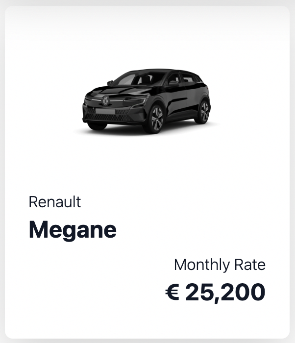

# VEHICULUM | Coding-Challenge | Serve app via NodeJS Server

<h4>I created this server using NestJs, docker-composer to create Mongodb database, and at the end of the project I used docker-composer to do a docker of the server.
For a lack of time, I just created a function to import the list of all makes and created a seed in MongoDB. </h4>
<h4>
In this folder you can also find the react client, inside it the file ModelPriceBar.js is pointing to <i>http://127.0.0.1:3001/api/makes</i> the rest of the client is pointing to the heroku app vehiculum used to create this coding challenge.</h4>
<h4>
To make the process of checking the app easier I didn't add the <b>.env</b> and <b>.env.prod</b> in .gitignore.
</h4>

<hr/>
</pre>

## To run the docker:

<h4>1) In the terminal:</h4>

```bash
docker-compose -f docker-compose.prod.yaml --env-file .env.prod up --build
```

<h4>2) On Postman:</h4>

```diff
+                                   Important!!!
+ after running docker-compose is necesary to use Postman to do a GET request to this address:

http://127.0.0.1:3001/seed

+ It will extract the information from the herokuapp of vehiculum and it will create the seed.

```

## Steps to run the client:

```
cd client
npm install
npm start
```

<h1>VEHICULUM | Coding challenge | Frontend</h1>

<h4>First of all, I would like to thank VEHICULUM for the opportunity to do this coding challenge, which gave me the chance to learn a couple of new things while working on it. I really enjoyed doing it.</h4>

<h4>If I had more time I would erase the "<span>&#60;</span> back" from the home page. And on the DetailPage I would use another component to put "Make and Model" above the carousel and leave the price under the carousel.</h4>

<h4>I would also try to separate the files inside the folders more clearly and I would try to write better code. Sometimes when I don't know how to do something I do it in an intuitive way. Sometimes it works but sometimes it doesn't look very clean. I think the code gets better with growing experience.</h4>

<h4>I would also write some tests.</h4>

<hr/>

```diff
+                                   Important!!!
```

<h4>It should be possible to see the make and model in the pictures.</h4> 
<h4>If it is not possible the seed didn't import the data!</h4>



<hr/>
<h2>In case something goes wrong with docker, these are the steps to run the server:</h2>

1. In the terminal write:

```
yarn install
```

2. Is important to have Nest CLI installed:

```bash
npm i -g @nestjs/cli
```

3. Start database:

```bash
docker-compose up -d
```

4. Start NestJs:

```bash
yarn start:dev
```

5. To create the database with the seed on Postman do a GET request to:

   http://localhost:3001/seed

<hr/>

## Stack Used

- MongoDB
- NestJs
- Docker-Compose
- React

<br/>
<h2>best regards 🙏🏼  🙌🏼</h2>
